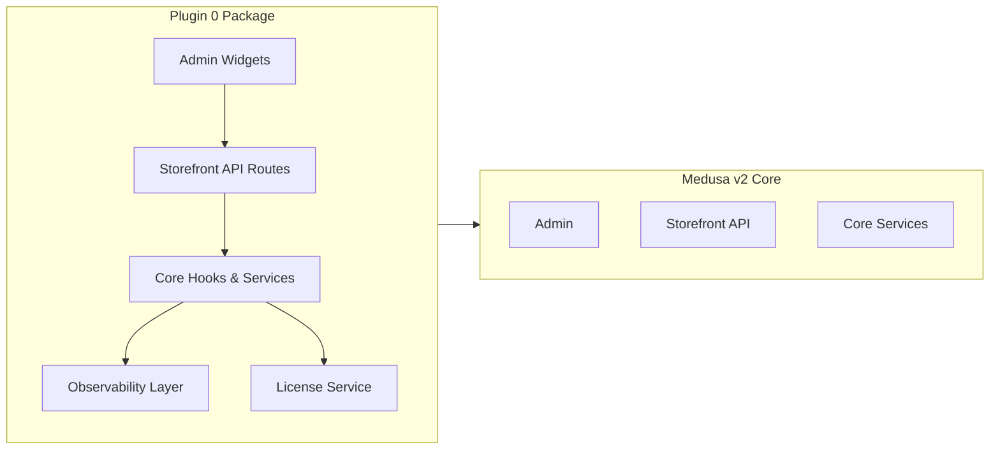

# Plugin 0 — Medusa v2 Freemium Plugin Boilerplate

**Maintained by [Andrew Nelson](https://www.andrewnelson.net) (a.k.a. [Atla](https://github.com/atlamors))**  
CTO at [Another Creative](https://www.anothercreative.ca/)

> **Namespace:** [`@atla/medusa-plugin-0`](https://www.npmjs.com/package/@atla/medusa-plugin-0)  
> **Source:** [github.com/atlamors/medusa-plugin-0](https://github.com/atlamors/medusa-plugin-0)  
> **Agency:** [anothercreative.ca](https://www.anothercreative.ca/)

## Overview
Plugin 0 is a **next-generation freemium plugin boilerplate** for Medusa v2, designed to accelerate the development of open-source plugins with a paid upgrade path. Inspired by ecosystems like Shopify and WordPress, Plugin 0 comes preloaded with the architectural patterns, DX tools, and monetization hooks you'll need.

## Features
- 🔑 **License Key System** – Pro features gated via API check, with graceful failure modes.
- 📊 **Observability** – Logging hooks for dev and metrics for business reporting.
- 🧩 **Complete Plugin Scaffolding** – Admin UI, Storefront API, core integration points.
- 🛠 **Settings UI** – Configurable options inside Medusa Admin, with potential extra tabs.
- 📄 **Auto Docs Generator** – Settings schema & routes documented automatically.
- 🧪 **Integration Test Ready** – Works with Medusa's `/integration-tests/` setup.
- 🌐 **Sample Storefront API Route** – Includes a healthcheck endpoint.
- ♻ **Composable Architecture** – 100% decoupled for installation via NPM.

## Architecture


## Quick Start
```bash
pnpm add @atla/medusa-plugin-0
```

### Register in `medusa.config.ts`
```ts
export const plugins = [
  {
    resolve: "@atla/medusa-plugin-0",
    options: {
      licenseKey: process.env.PLUGIN_0_LICENSE_KEY,
      proFeatures: true,
    },
  },
]
```

## Quickstart (Monorepo)

1) Install deps and enable Corepack
```bash
corepack enable
pnpm install
```

2) Start dev servers (ports: Next.js 3011, Medusa 9011)
```bash
pnpm dev
```

3) Verify health
```bash
curl http://localhost:9011/store/plugin-0/health
```

4) Optional: set a license key (stubbed)
```bash
curl -X POST http://localhost:9011/admin/plugin-0/license -H 'content-type: application/json' -d '{"licenseKey":"pro_abc"}'
```

## Healthcheck API Example
```ts
import type { MedusaRequest, MedusaResponse } from "@medusajs/framework"

export async function GET(req: MedusaRequest, res: MedusaResponse) {
  res.json({
    status: "ok",
    plugin: "plugin-0",
    timestamp: new Date().toISOString()
  })
}
```

## Licensing & Freemium Model
- Free tier: Core functionality open-sourced under MIT.
- Pro tier: Additional features unlocked via license key.
- Offline & grace modes to prevent lockout due to temporary connectivity loss.

## Compatibility
- Medusa: v2
- Node.js: 20 and 22 (tested); minimum 20

## Development Roadmap
See [ROADMAP.mdx](./ROADMAP.mdx) for active build steps.

## Routes

<!-- ROUTES:START -->

<!-- ROUTES:END -->

## Options

<!-- OPTIONS:START -->

<!-- OPTIONS:END -->

## Plugin Packaging & Best Practices

- Package exports
  - `exports['./package.json']` is exposed so Medusa can resolve plugin metadata.
  - Root export provides ESM, CJS, and types.

- Peer and dev dependencies
  - `peerDependencies`: `@medusajs/framework@^2.9.0`, `@medusajs/medusa@^2.9.0`.
  - `devDependencies`: `@medusajs/{cli,framework,medusa,admin-sdk}@2.9.0`, `@swc/core`.
  - This matches plugin tooling guidance in Medusa’s docs.

- Scripts
  - `dev`: `medusa plugin:develop` – watches, builds, and publishes to a local registry with HMR of admin extensions.
  - `build`: `medusa plugin:build` – outputs to `.medusa/server` per Medusa’s packaging format.
  - `plugin:db:generate`: generate migrations if your modules define entities.

- Tree-shaking & files
  - `sideEffects: false` for better bundling.
  - Only publish `dist` and doc files.

- Versioning & publishing
  - Use Changesets in the monorepo for version bumps.
  - Publish with `npm publish --provenance` (CI configured separately).

## Next Steps

- Subpath exports (optional)
  - If you’ll import module resources from apps, expose subpaths:
    - `"./workflows": "./dist/workflows/index.js"`
    - `"./modules": "./dist/modules/index.js"`
  - Then import in apps as `import { MyWorkflow } from "@atla/medusa-plugin-0/workflows"`.

- DB entities & migrations
  - Replace temp file persistence with Medusa module entities + migrations and run `plugin:db:generate`.

- Admin UX
  - Expand `src/admin/widgets` with real forms and validation.
  - Add an Admin UI route if you need custom pages.

- Docs generator
  - Extend the generator to include endpoint descriptions and examples.

- Compatibility keywords
  - If you integrate a third-party provider, add the appropriate `medusa-plugin-*` keyword for Medusa’s integrations listing.

For Medusa plugin best practices and commands, see the official guide: [Create a Plugin](https://docs.medusajs.com/learn/fundamentals/plugins/create).
